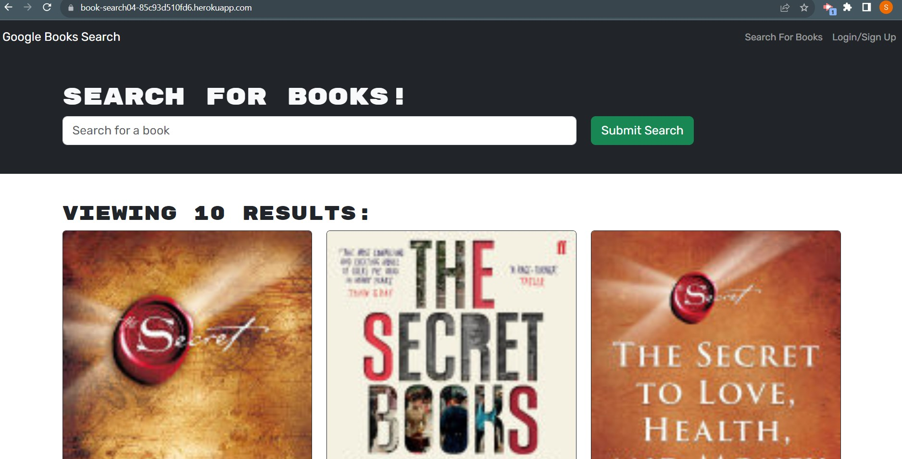

# Book Search Engine

## Description

Book Search Engine is an application that enables users to search for books stored in google API. If the user is logged in, they can save books to their account. They can also view their saved books with the option to remove them. Its primary purpose is to facilitate the discovery and retrieval of information about books, authors, and related content.

## Table of Contents

- [Live Demo](#live-demo)
- [Installation](#installation)
- [Usage](#usage)
- [Technologies](#technologies)
- [Credits](#credits)
- [Contact Information](#contact-information)

## Live Demo

Check out the live demo of my portfolio [here](https://book-search04-85c93d510fd6.herokuapp.com/).

### Preview

- HomePage
  

- Demo Video


## Installation

To run this project locally, follow these steps:

- Clone the repository from GitHub
- Open the terminal and navigate to root directory. Install required dependencies given in package.json by running command:

  ```
  npm install
  ```

- Run `npm run develop` to start the application

## Usage

- When user loadsthe search engine then they can see menu with the options Search for Books and Login/Signup and an input field to search for books and a submit button. After searching for book by entering name in input field without logging in, several search results, each featuring a book’s title, author, description, image, and a link on image to read that book on the Google Books site get displayed on same page.
- When user clicks on login/signup option, then modal opens with toggle button to toggle between the option to log in or sign up. User needs to enter username, an email address, and a password for creating account.
- After signup/ login button clicked, it will close modal if entered credentials are correct otherwise it will show an error. Now menu options will be changed and it will have options to Search for Books, an option to see my saved books, and Logout. Search results will include save button to save books information in account to read it later.
- When user menu option to see saved books then page shows all of the books that saved to user' account, each featuring the book’s title, author, description, image, and a link on image to read that book on the Google Books site and a button to remove a book from my account
- To remove book from saved books list, user will click remove button shown on saved book.


## Technologies

1. React.js
2. React Router
3. Javascript
4. Vite
5. Apollo Client
6. Apollo Server (Express)
7. GraphQL
8. jsonwebtoken
9. MongoDB,Mongoose

## Credits

References:

https://stackoverflow.com/questions/60323551/how-to-exclude-password-field-in-the-response-in-mongodb

https://stackoverflow.com/questions/30202755/react-router-open-link-in-new-tab

## Contact Information

Github Username: [sakshiarora04](https://github.com/sakshiarora04)

Email id: sakshiarora245@gmail.com
